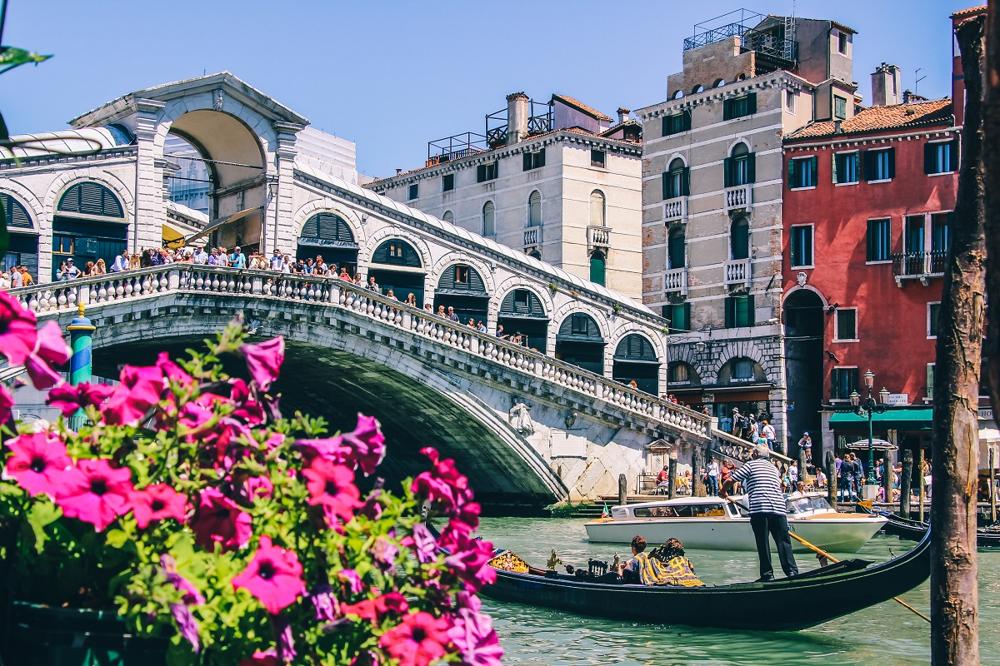

L'Italie, située dans le sud de l'Europe, est un pays empreint d'une richesse historique et culturelle extraordinaire. De ses villes emblématiques comme Rome, Florence et Venise à ses trésors artistiques, tels que les chefs-d'œuvre de Michel-Ange et de Léonard de Vinci, l'Italie est un musée à ciel ouvert. C'est aussi le berceau de la Renaissance, un mouvement artistique qui a façonné le monde moderne. Sa cuisine exquise, caractérisée par les pâtes, les pizzas, les fromages et les vins renommés, régale les papilles des gourmets du monde entier. Les magnifiques côtes de l'Italie, les Alpes majestueuses et les îles pittoresques comme la Sicile ajoutent à sa beauté naturelle. L'Italie, c'est l'art, la gastronomie, l'histoire et le charme méditerranéen, faisant de ce pays un incontournable pour les voyageurs en quête d'une expérience culturelle inoubliable.

[Aller à Madagascar](https://github.com/WildGhost21/AR1/blob/main/Madagascar.md)

#AHMED_MESSAOUD_WALID